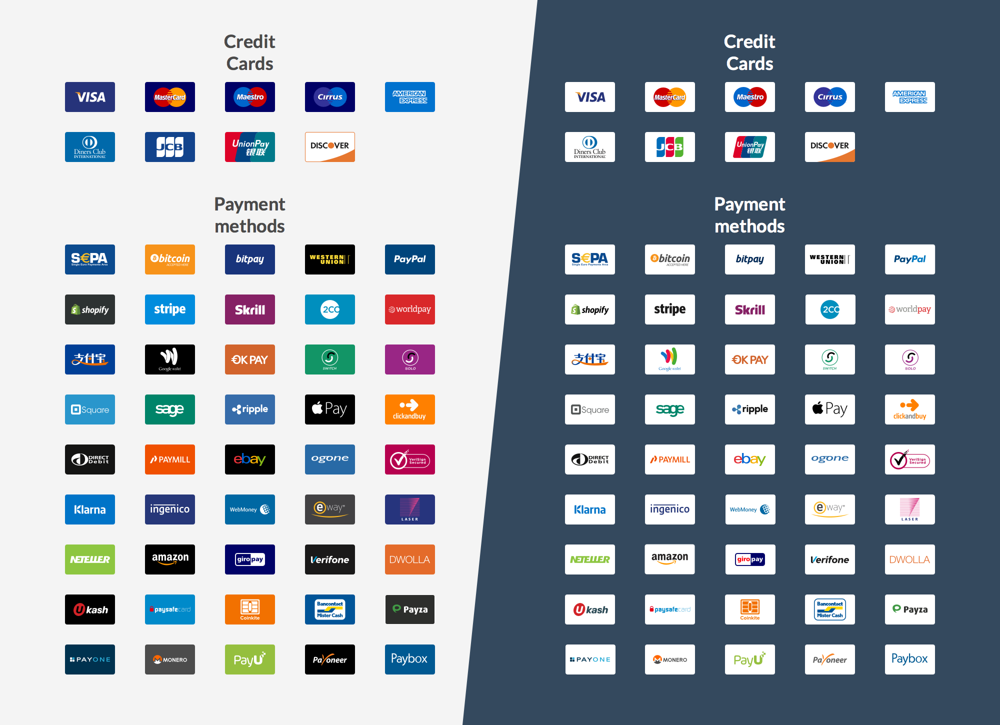
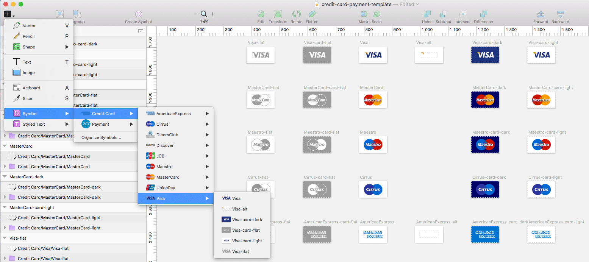
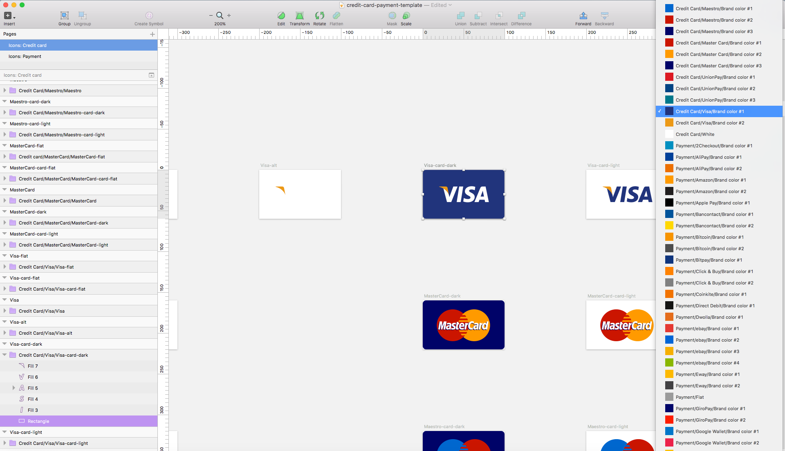

# Payment and credit card icons
Sketch template with graphical assets for credit cards and payment icons.
The whole template is built so you easily can extend your ongoing graphical work. Created by [Gregoire Segretain](https://twitter.com/gregoiresgt) and [Jonas Bröms](https://twitter.com/jonasbroms).

## Table of contents
* [File formats](#file-formats)
* [Credit cards](#credit-cards)
* [Payment](#payments)
* [Symbol Structure](#symbol-structure)
* [Shared styles structure](#shared-styles-structure)
* [What's new](#Whats-new)
* [Future improvements](#future-improvements)
* [Versioning](#versioning)
* [Creators](#creators)
* [Special thanks to](#special-thanks-to)
* [Copyright and license](#copyright-and-license)
* [Disclaimer](#Disclaimer)

## File formats
Following file formats are included within this template:
* Sketch file
* Installable font (.eot, .ttf, .woff)
* SVG files
* SVG sprite file
* PNG files (Sizes: 100x60, @2x, 128x77, 256x154, 512x307)

### Credit cards
Following credit cards are included within the Sketch template:
* [Visa](https://www.visa.com)
* [MasterCard](https://www.MasterCard.com)
* [MasterCard](http://www.maestrocard.com/)
* Cirrus
* [American Express](https://www.americanexpress.com/)
* [Diners Club International](http://www.dinersclub.com/)
* [JCB](http://www.jcbcard.com/)
* [Union Pay](http://www.unionpayintl.com/)
* [Discover](https://www.discover.com/)

### Payments:
Following payment are included within the Sketch template:
* SEPA - Single Euro Payments Area
* [Bitcoin - Accepted here](https://bitcoin.org)
* [Bitpay](https://bitpay.com/)
* [Western Union](https://www.westernunion.com)
* [PayPal](https://www.paypal.com)
* [Shopify](https://www.shopify.com/)
* [Stripe](https://stripe.com/)
* [Skrill](https://www.skrill.com/)
* [2Checkout](https://www.2checkout.com/)
* [World pay](http://www.worldpay.com/)
* [AliPay](https://intl.alipay.com/)
* [Google Wallet](https://www.google.com/wallet/)
* Switch
* Solo
* [Square](https://squareup.com)
* [Ripple](https://ripple.com/)
* [Apple Pay](http://www.apple.com/apple-pay/)
* [Direct Debit](http://www.directdebit.co.uk/)
* [Paymill](https://www.paymill.com/)
* [Ebay](https://www.ebay.com/)
* [Ogone](https://www.ogone.com/)
* [VeriSign](https://www.verisign.com/)
* [Klarna](https://www.klarna.com/)
* [Ingenico](https://www.ingenico.com/)
* [Webmoney](http://www.wmtransfer.com/)
* [Eway](https://eway.io/)
* Laser
* [Neteller](https://www.neteller.com/)
* [Amazon](https://payments.amazon.com/)
* [GiroPay](https://www.giropay.de/)
* [VeriFone](https://www.verifone.com/)
* [Dwolla](https://www.dwolla.com/)
* [Ukash](https://www.paysafecard.com)
* [Paysafe card](https://www.paysafecard.com)
* [Coinkite](https://www.coinkite.com/)
* [Bancontact](https://www.bancontact.com/)
* [Payza](https://www.payza.com/)
* [Payone](https://www.payone.de/)
* [Monero](https://getmonero.org/)
* [PayU](https://www.payU.com/)
* [Payoneer](http://www.payoneer.com/)
* [Paybox](http://www1.paybox.com/)

## Symbol structure
For further and more detailed information, look at the picture.

```
Symbols/
├── Credit cards/
│   ├── Visa
│   │   ├── Visa    
│   │   ├── Visa-alt
│   │   ├── Visa-card-dark
│   │   ├── Visa-card-flat
│   │   ├── Visa-card-light
│   │   └── Visa-flat
│   ├── MasterCard
│   ├── Maestro
│   ├── Cirrus
│   ├── American Express
│   ├── Diner Club International
│   ├── JCB
│   └── Discover
└── Payments/
    ├── SEPA - Single Euro Payments Area
    └── Bitcoin - Accepted here
    └── Bitpay
    └── Western Union
    └── PayPal
    └── Shopify
    └── Shopify
    └── Stripe
    └── Skrill
    └── 2CC
    └── World pay
    └── AliPay
    └── Google Wallet
    └── Switch
    └── Solo
    └── Square
    └── Ripple
    └── Apple Pay
    └── Direct Debit
    └── Paymill
    └── Ebay
    └── Ogone
    └── VeriSign
    └── Klarna
    └── Ingenico
    └── Webmoney
    └── Eway
    └── Laser
    └── Neteller
    └── Amazon
    └── GiroPay
    └── VeriFone
    └── Dwolla
    └── Ukash
    └── Paysafe card
    └── Coinkite
    └── Bancontact
    └── Payza
    └── Payone
    └── Monero
    └── PayU
    └── Payoneer
    └── Paybox
```


## Shared styles structure
For further and more detailed information, look at the picture.

```
Shared styles/
├── Credit cards/
│   ├── ** White **
│   ├── Visa
│   │   ├── ** Brand color #1 **
│   │   └── ** Brand color #2 **
│   ├── MasterCard
│   ├── Maestro
│   ├── Cirrus
│   ├── American Express
│   ├── Diner Club International
│   ├── JCB
│   └── Discover
└── Payments/
    ├── ** White **
    ├── SEPA - Single Euro Payments Area
    ├── Bitcoin - Accepted here
    ├── Bitpay
    ├── Western Union
    ├── PayPal
    ├── Shopify
    ├── Shopify
    ├── Stripe
    ├── Skrill
    ├── 2CC
    ├── World pay
    ├── AliPay
    ├── Google Wallet
    ├── Switch
    ├── Solo
    ├── Square
    ├── Ripple
    ├── Apple Pay
    ├── Direct Debit
    ├── Paymill
    ├── Ebay
    ├── Ogone
    ├── VeriSign
    ├── Klarna
    ├── Ingenico
    ├── Webmoney
    ├── Eway
    ├── Laser
    ├── Neteller
    ├── Amazon
    ├── GiroPay
    ├── VeriFone
    ├── Dwolla
    ├── Ukash
    ├── Paysafe card
    ├── Coinkite
    ├── Bancontact
    ├── Payza
    ├── Payone
    ├── Monero
    ├── PayU
    ├── Payoneer
    └── Paybox
```



## What's new
* Every icon is made into a symbol
* Symbol Structure within Sketch for easier access
* Brand colors (as shared styles)
* All shared styles have a structure
* Minor changes to some cards so that the are coherent with the brand guidelines
* Flat icons (logotypes and cards)
* Documentation
* Copyright and license
* Disclaimer

## Future improvements
* Update some of the logotypes
* Make optimizations to the whole framework
* Make it more lightweight so it runs smoother
* Make 3D versions/gradients
* Present the font icons like fontawesome

## Versioning
0.5

## Creators
** Gregoire Segretain **
* [Twitter](https://twitter.com/gregoiresgt)
* [GitHub](https://github.com/gregoiresgt)

** Jonas Bröms **
* [Twitter](https://twitter.com/jonasbroms)
* [GitHub](https://github.com/bromso)

## Special thanks to:
[IcoMoon](https://icomoon.io/app/)

## Copyright and license
Graphical assets, files, code and documentation released under the [MIT](https://). Docs released under [Creative Commons](https://).

## Disclaimer
While we have redrawn and shared these assets for the benefit of the design community, we do not own any of the underlying products, logotype or user interface designs. By accessing these assets, you agree to obtain all necessary permissions from the underlying rights holders and/or adhere to any applicable brand use guidelines before using them. We disclaims all express or implied warranties with respect to these assets, including non-infringement of intellectual property rights.
